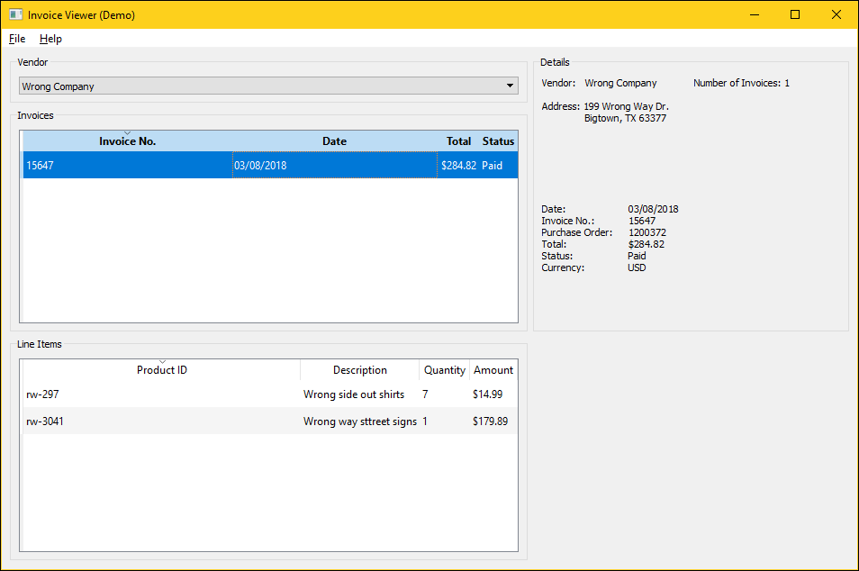
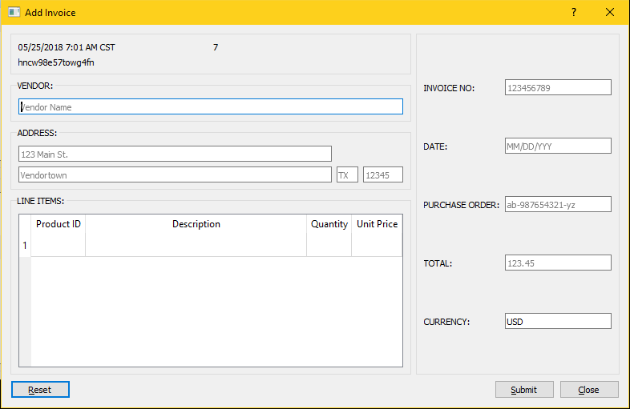

What can you use Go for? If you were to search Google for the answer to that
question at the time of this writing (August 2018), you would find a lot of
stuff saying how Go was built for and works well for building web applications
due to the easy to use concurrency features in Go. You might find posts where
people ask about GUI features and packages, and some might even say that Go
might not be a good language for building GUIs. Well, here I present to you
a GUI app written entirely with Go.

## The App: Invoice Viewer
A simple desktop GUI for viewing invoice information.

## Some Background:
I've been doing some Robotic Process Automation (RPA) lately, and I wanted
to build a small desktop app for the purpose of showing an RPA demo to clients.
This Invoice Viewer app is simply a GUI for demo purposes. It has the functionality
to enter invoice information in a form, and it displays information about vendors
and invoices in table views.

My actual RPA demo is not included in this repo. 
If you want to do RPA stuff with this app, then you can use your own RPA tools.
I have run RPA demos with this app using my own Go programs and also with the
commercial RPA software UiPath.

## Why did I use Go? 
I have mostly been a python user, but recently started dabbling in Go just
out of curiosity. I like Go a lot. It was easy to learn. It is easy to use.
It compiles fast and program execution is fast. By some benchmarks, it is 
of comparable speed to C/C++ and Java.

Python is popular, and many have said it is fun and easy to learn and use;
especially by those working in data analytics. I would say that Go is
comparable to Python in this nature, although not yet as mature as Python.

## Why did I use Qt?
Simply put, I've worked with Qt before. The GUI libraries aren't quite there for Go.
There are some bindings for [QT](https://github.com/therecipe/qt) - used for this app, and [GTK](https://github.com/mattn/go-gtk) which I have never used. There is also
an experimental GUI package in the [Golang](https://github.com/golang) repository called
[shiny](https://github.com/golang/exp/tree/master/shiny) which as of this writing seems to still have some activity. One more GUI package that looks to have potential is
[go-astilectron](https://github.com/asticode/go-astilectron), which is a way to build a desktop app with a Javascript web-app style interface. Those of you who use the [Atom](https://atom.io/) editor may be familiar with that. Other GUI packages that I came across didn't seem to be actively maintained.

## Purpose & Functionality
This application was originally built to serve as a demo for automation purposes.
The app interacts with data from a MongoDB backend, and a Qt5 frontend.

### What it Looks Like:



### How to get it?
Just clone it. There are no plans to make it go gettable.

### Dependencies:
I have run this app on both Windows 10 and Ubuntu 18.04.
This app was built with Go version 1.10.2.

Go Packages:

1. [gopkg.in/mgo.v2](https://github.com/go-mgo/mgo/tree/v2) - Whoa! This one has recently reported itself as being UNMAINTAINED. Well, it still works for this app. You will need
	1. [MongoDB 4.0.0](https://www.mongodb.com/download-center?jmp=nav#community) - download the installer for your system. There are many tutorials online and [MongoDB](https://docs.mongodb.com/manual/installation/) has some good docs for getting started.
	2. [Robo 3T](https://robomongo.org/) - optional. This is a nice GUI for viewing your MongoDB databases and testing queries.
2. [github.com/therecipe/qt](https://github.com/therecipe/qt) - You will need to dig into this repo to figure out how to get everything installed for your system.
	1. [Qt 5.10.1](https://www.qt.io/download-qt-installer?hsCtaTracking=9f6a2170-a938-42df-a8e2-a9f0b1d6cdce%7C6cb0de4f-9bb5-4778-ab02-bfb62735f3e5) - there is a new version, 5.11, that hasn't been tested with this app. Download Qt from the link provided, or look through [github.com/therecipe/qt](https://github.com/therecipe/qt) to find other ways of getting Qt.

### NOTES:
The MongoDB server needs to be running before the app is launched. This app uses the 
default MongoDB port 27017
	To start the MongoDB server (localhost) enter the following into a console:
```
$(linux):sudo service mongod start
$(windows):%MONGODPATH% mongod start
```

To stop the server:
```
$(linux):sudo service mongod stop
$(windows):%MONGODPATH% mongod stop
```

To build the app, enter the following into a console:
```
$(linux):export CGO_LDFLAGS_ALLOW=".*"
$(linux):qtmoc desktop
$(linux):qtrcc desktop  # currently not needed since there are no resources
$(linux):go build -o InvoiceViewer.lex

$(windows):qtdeploy build desktop
```

I used the file ending '.lex' to denote **l**inux **ex**ecutable.


There exists a file `Data/createDummyData.go` to insert some initial data into the MongoDB. The MongoDB server will need to be running. Simply run 
```
go run createDummyData.go
```
in the Data directory to execute the script.

## Contributing
* Use it - I would appreciate a citation or reference back to me.
* Break it - Tell me what doesn't work.
* Fix it - Fix what's broken and send a pull request.
* Modify it - Help make it better and send a pull request.
* Talk about it - Have any questions, comments, or concerns? Raise an issue.

#### Copyright 2016 Cory Robinson.
All rights reserved.
Use of this source code is governed by a MIT-style
license that can be found in the LICENSE.txt file.